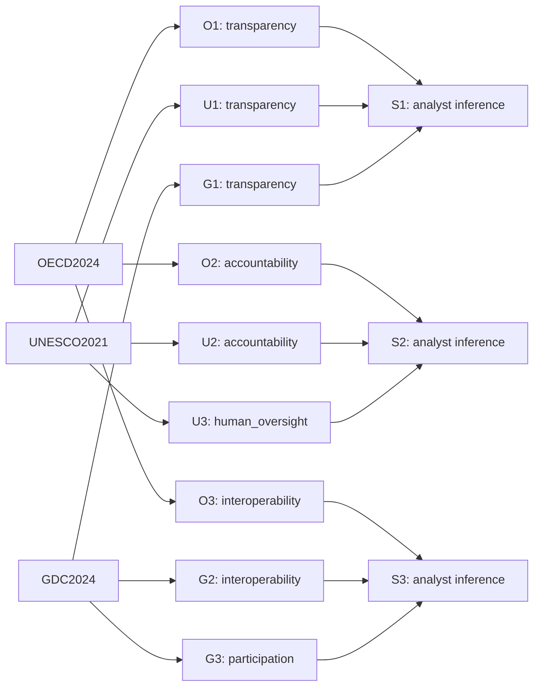

# Concept map

```mermaid
flowchart LR
  OECD2024 --> O1["O1: transparency"]
  OECD2024 --> O2["O2: accountability"]
  OECD2024 --> O3["O3: interoperability"]
  UNESCO2021 --> U1["U1: transparency"]
  UNESCO2021 --> U2["U2: accountability"]
  UNESCO2021 --> U3["U3: human_oversight"]
  GDC2024 --> G1["G1: transparency"]
  GDC2024 --> G2["G2: interoperability"]
  GDC2024 --> G3["G3: participation"]
  O1 --> S1["S1: analyst inference"]
  U1 --> S1["S1: analyst inference"]
  G1 --> S1["S1: analyst inference"]
  O2 --> S2["S2: analyst inference"]
  U2 --> S2["S2: analyst inference"]
  U3 --> S2["S2: analyst inference"]
  O3 --> S3["S3: analyst inference"]
  G2 --> S3["S3: analyst inference"]
  G3 --> S3["S3: analyst inference"]
```

Edges show citation relationships, not legal equivalence or causal proof.
